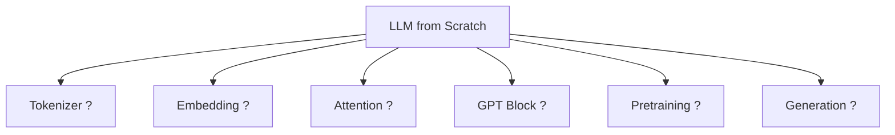

# Week 0 初始知识图谱

在正式学习前绘制 LLM from Scratch 初始知识图谱。

可以使用 Mermaid、手绘图截图或其他工具。

## 初始版本

```mermaid
graph TD
  A["LLM from Scratch"]
  A --> B["Tokenizer ?"]
  A --> C["Embedding ?"]
  A --> D["Attention ?"]
  A --> E["GPT Block ?"]
  A --> F["Pretraining ?"]
  A --> G["Generation ?"]
```

## 我不确定的连接

- 待填写。

