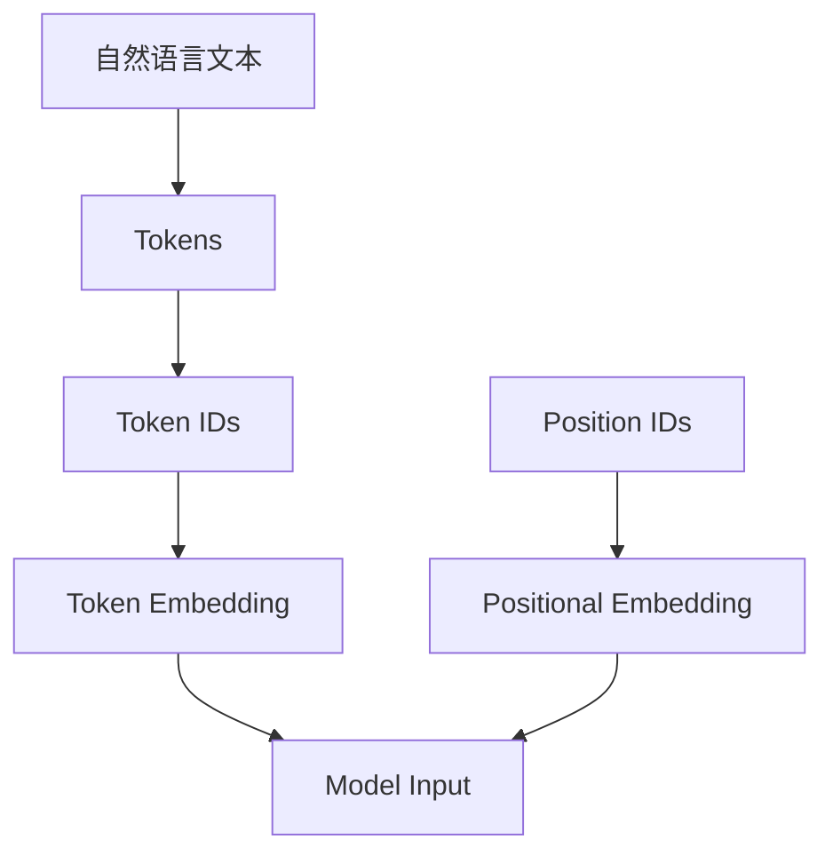

# Week 2 Tokenizer / Embedding 知识图谱

```mermaid
graph TD
  Text["自然语言文本"] --> Tokens["Tokens"]
  Tokens --> TokenIDs["Token IDs"]
  TokenIDs --> TokenEmbedding["Token Embedding"]
  Position["Position IDs"] --> PosEmbedding["Positional Embedding"]
  TokenEmbedding --> ModelInput["Model Input"]
  PosEmbedding --> ModelInput
```

## 本周新增理解

- 待填写。

