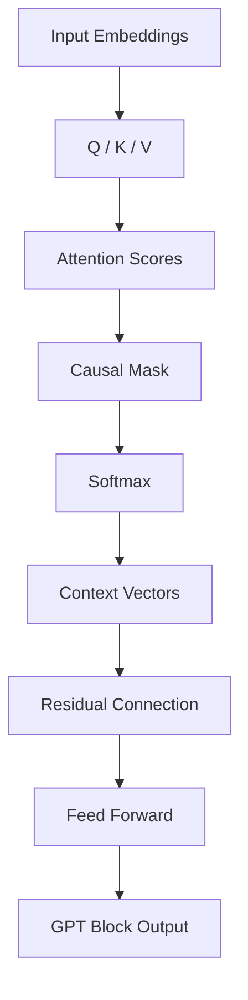

# Week 4 Attention / GPT Block 知识图谱

```mermaid
graph TD
  X["Input Embeddings"] --> QKV["Q / K / V"]
  QKV --> Scores["Attention Scores"]
  Scores --> Mask["Causal Mask"]
  Mask --> Softmax["Softmax"]
  Softmax --> Context["Context Vectors"]
  Context --> Residual["Residual Connection"]
  Residual --> FFN["Feed Forward"]
  FFN --> Block["GPT Block Output"]
```

## 本周新增理解

- 待填写。

