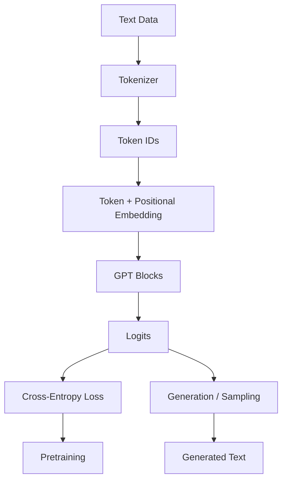

# Week 8 最终 LLM 知识图谱

```mermaid
graph TD
  Text["Text Data"] --> Tokenizer["Tokenizer"]
  Tokenizer --> TokenIDs["Token IDs"]
  TokenIDs --> Embedding["Token + Positional Embedding"]
  Embedding --> GPTBlock["GPT Blocks"]
  GPTBlock --> Logits["Logits"]
  Logits --> Loss["Cross-Entropy Loss"]
  Loss --> Training["Pretraining"]
  Logits --> Sampling["Generation / Sampling"]
  Sampling --> Output["Generated Text"]
```

## 与 Week 0 相比的变化

- 待填写。

